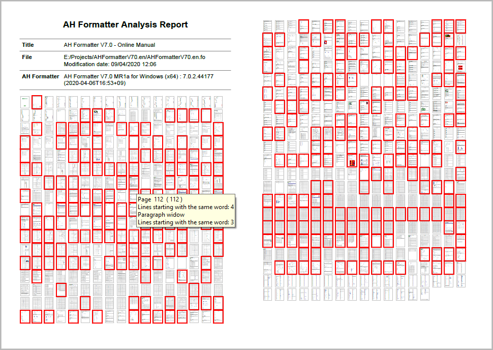
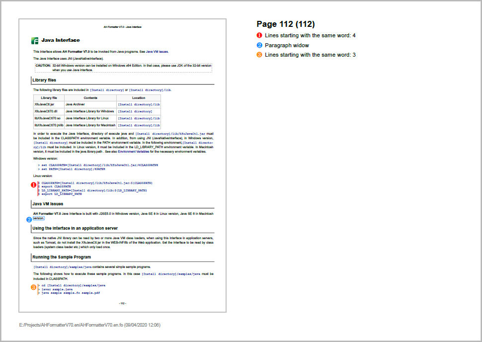

# `analysis-utility` - AH Formatter Analysis Utility
Stylesheets and scripts for working with the results from AH Formatter automated analysis.

## Windows

````
usage: analyzer -d file [-format format] [-lang lang]
                [-ahfcmd AHFCmd] [-opt "options"]
                [-xslt xslt] [-xsltparam "xslt-params" ]
                [-transformer transformer ]
                [-pdfver pdfver] [-force yes]

       file    : File to format and analyze
       format  : Analysis result format -- annotate or report
                 Default is 'annotate'
       lang    : Language for error messages -- en or ja
                 Default is 'en'
       AHFCmd  : Path to AHFCmd.exe
       options : Additional AHFCmd command-line parameters
       xslt    : XSLT stylesheet to use
       xslt-params : XSLT processor parameters
       transformer : XSLT 1.0 processor -- msxsl, xsltproc, or saxon6
                     Used with 'annotate' result format only
       pdfver  : PDF version of reports. Default is 'PDF1.7'
       -force yes  : Force all stages to run
````

`analyzer` generates a report in one of two formats:

- `-format annotate` (the default) generates a PDF version of the formatted source document that has additional PDF annotations and PDF layers.
- `-format report` generates a PDF report that includes a copy of every page that contains an analysis error.

### `-format annotate`

This runs an XSLT 1.0 stylesheet and requires `msxsl.exe`, `xsltproc.exe`, or `java.exe` to be on the PATH. The script will use the first of these that it finds, or a specific processor can be selected with the `-transformer` parameter.

`msxsl.exe` can be downloaded from https://www.microsoft.com/en-us/download/details.aspx?id=21714

The script uses its built-in `annotate.xsl` stylesheet to annotate the Area Tree XML for the formatted document with indications of the error areas. An alternative XSLT stylesheet can be specified with the `-xslt` parameter. Additional options and parameters can be passed to the XSLT processor with the `-xsltparam` parameter. The options and parameters must be in the correct syntax for the XSLT processor that will be used, since the `-xsltparam` value is not modified before being used.

### `-format report`

This runs the built-in `compact-report.xsl` XSLT 3.0 stylesheet and requires `java.exe` to be on the PATH.

The stylesheet generates a PDF report . An alternative XSLT stylesheet can be specified with the `-xslt` parameter. Additional options and parameters can be passed to the XSLT processor with the `-xsltparam` parameter. The options and parameters must be in the correct syntax for the XSLT processor that will be used, since the `-xsltparam` value is not modified before being used.

## Linux

````
usage: analyzer.sh -d file [-opt "options"] [-lang lang] [-ahfcmd AHFCmd]
                   [-xslt xslt] [-xsltparam "xslt-params" ]

       file    : File to format and analyze
       options : Additional AHFCmd command-line parameters
       lang    : Language for error messages -- en or ja
       AHFCmd  : Location of 'run.sh'
       xslt    : XSLT stylesheet to use
	   xslt-params : XSLT processor options and parameters
````

Requires `xsltproc` and `getopt` to be on the path.

Expects AH Formatter to be installed at `/usr/AHFormatterV70_64/run.sh`.

The script uses its built-in `annotate.xsl` stylesheet to annotate the Area Tree XML for the formatted document with indications of the error areas. An alternative XSLT stylesheet can be specified with the `-xslt` parameter. Additional options and parameters can be passed to the XSLT processor with the `-xsltparam` parameter. The options and parameters must be in the correct syntax for the XSLT processor that will be used, since the `-xsltparam` value is not modified before being used.

## Apache Ant

### Annotated PDF
````
ant -f build.xml ahfcmd-annotated-pdf.single -Dsingle=<file> -Dlang=<lang>

       <file>  : File to format and analyze
       <lang>  : Language for error messages -- en or ja
````

### Report PDF
````
ant -f build.xml ahfcmd-report-pdf.single -Dsingle=<file> -Dlang=<lang>

       <file>  : File to format and analyze
       <lang>  : Language for error messages -- en or ja
````

### Customizing Ant

Ant properties can be set in `properties.local.xml` in the current directory or in `system.local.properties` in the **analysis-utility** directory. Do not modify `system.properties` as your changes could be overwritten when **analysis-utility** is updated.

## Report PDF

The provided stylesheet generates the XSL-FO for a report that comprises a summary page (or pages) plus a separate page for every page in the source document for which an error is reported.

The first summary page contains some information about the source document and the AH Formatter version that was used to format the source document followed by thumbnail images of the pages of the formatted document. If there are too many images to fit on one page, the images continue on further pages.



The thumbnails of pages that contain errors are shown with a red border. When viewing the PDF in a reader, hovering your mouse over a thumbnail shows a tooltip that shows the page number and a summary of the errors. Clicking on a thumbnail of a page jumps to the report page for that page.

A report page contains an image of the formatted source page plus a list of the errors on that page. The page image is annotated to show the position of the error areas.





## Localization

The `-lang` parameter specifies the language of generated text in the PDFs generated by these scripts.

The localized strings are specified in property files in the `xslt/locales` directory. These file are in the Java XML property file format.

Support for a new language may be added by copying and modifying `ja.xml`.
