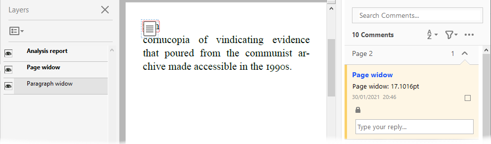
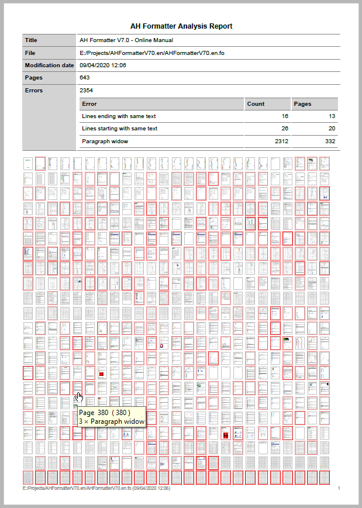
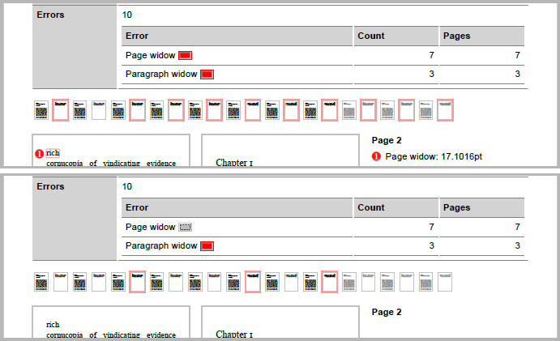
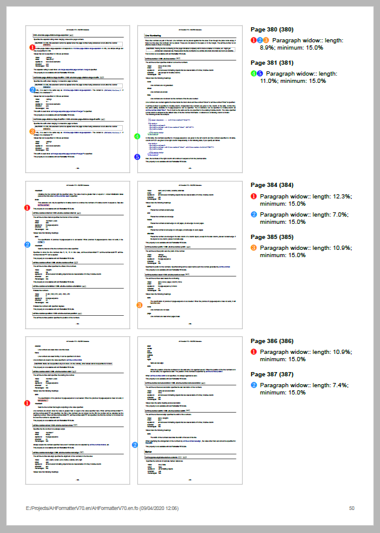
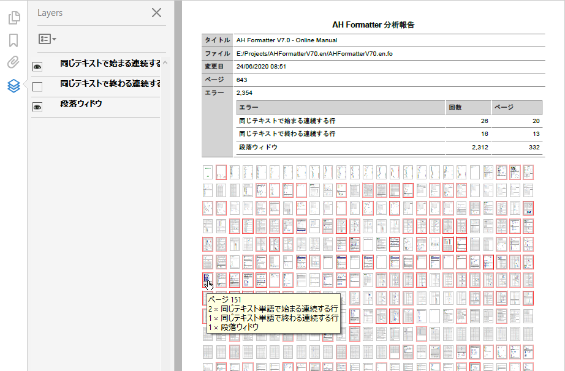
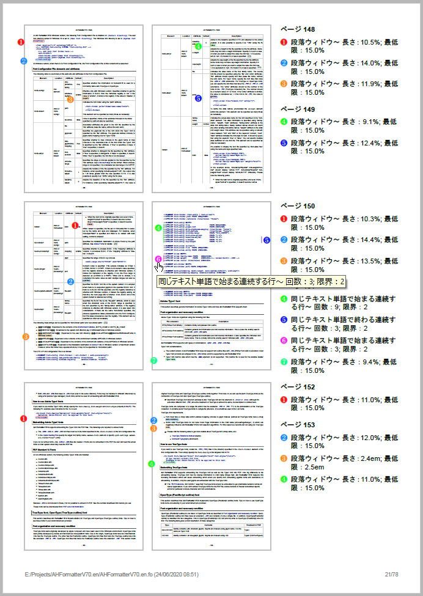

* [English](#en)
* [日本語](#ja)

----

# <a name="en"></a>`analysis-utility` - AH Formatter Analysis Utility

Stylesheets and scripts for working with the results from AH Formatter automated analysis.

This utility can produce PDF reports in two formats: a version of the complete formatted document with annotations for every detected error or report that shows every page that contains an error (see "[Report](#en-report)").

There are scripts for running the utility on [Windows](#en-windows) or [Linux](#en-linux) as well as an [Ant build file](#en-ant) for use on either platform.

## <a name="en-windows"></a> Windows

````
usage: analyzer -d file [-format format] [-lang lang]
                [-ahfcmd AHFCmd] [-opt "options"]
                [-xslt xslt] [-xsltparam "xslt-params" ]
                [-transformer transformer ]
                [-pdfver pdfver] [-force yes] [-js no ]
                [-show no]

       file    : File to format and analyze
       format  : Analysis result format -- annotate or report
                 Default is 'annotate'
       lang    : Language for error messages -- en or ja
                 Default is 'en'
       AHFCmd  : Path to AHFCmd.exe
       options : Additional AHFCmd command-line parameters
       xslt    : XSLT stylesheet to use
       xslt-params : XSLT processor parameters
       transformer : XSLT 1.0 processor -- msxsl, xsltproc, or saxon6
                     Used with 'annotate' result format only
       pdfver  : PDF version of reports. Default is 'PDF1.7'
       -force yes  : Force all stages to run
       -js no      : Do not include JavaScript in PDF report
       -show no    : Do not open the PDF report
````

`analyzer` generates a report in one of two formats:

- `-format annotate` (the default) generates a PDF version of the formatted source document that has additional PDF annotations and PDF layers.
- `-format report` generates a PDF report that includes a copy of every page that contains an analysis error.

The PDF opens automatically unless `-show no` is specified.

### `-format annotate`

This runs an XSLT 1.0 stylesheet and requires `msxsl.exe`, `xsltproc.exe`, or `java.exe` to be on the PATH. The script will use the first of these that it finds, or a specific processor can be selected with the `-transformer` parameter.

`msxsl.exe` can be downloaded from https://www.microsoft.com/en-us/download/details.aspx?id=21714

The script uses its built-in `annotate.xsl` stylesheet to annotate the Area Tree XML for the formatted document with indications of the error areas. An alternative XSLT stylesheet can be specified with the `-xslt` parameter. Additional options and parameters can be passed to the XSLT processor with the `-xsltparam` parameter. The options and parameters must be in the correct syntax for the XSLT processor that will be used, because the `-xsltparam` value is not modified before being used.

### `-format report`

This runs the built-in `compact-report.xsl` XSLT 3.0 stylesheet and requires `java.exe` to be on the PATH.

The stylesheet generates a PDF report. (See "[Report](#en-report)".) An alternative XSLT stylesheet can be specified with the `-xslt` parameter. Additional options and parameters can be passed to the XSLT processor with the `-xsltparam` parameter. The options and parameters must be in the correct syntax for the XSLT processor that will be used, because the `-xsltparam` value is not modified before being used.

## <a name="en-linux"></a> Linux

````
usage: analyzer.sh -d file [-format format] [-lang lang]
                   [-ahfcmd AHFCmd] [-opt "options"]
                   [-xslt xslt] [-xsltparam "xslt-params" ]
                   [-pdfver pdfver]
    echo
       file    : File to format and analyze
       format  : Analysis result format -- annotate or report
                 Default is 'annotate'
       lang    : Language for error messages -- en or ja
                 Default is 'en'
       AHFCmd  : Path to 'AHFCmd' or 'run.sh'
       options : Additional AHFCmd command-line parameters
       xslt    : XSLT stylesheet to use
       xslt-params : XSLT processor options and parameters
       pdfver  : PDF version of reports. Default is 'PDF1.7'
````

`analyzer.sh` generates a report in one of two formats:

- `-format annotate` (the default) generates a PDF version of the formatted source document that has additional PDF annotations and PDF layers.
- `-format report` generates a PDF report that includes a copy of every page that contains an analysis error.

Requires `getopt` to be on the path.

Expects AH Formatter to be installed at `/usr/AHFormatterV71_64/run.sh` or `/usr/AHFormatterV70_64/run.sh`. An alternative AH Formatter can be specified with `-ahfcmd`.

### `-format annotate`

This runs an XSLT 1.0 stylesheet and requires `xsltproc` to be on the path.

The script uses its built-in `annotate.xsl` stylesheet to annotate the Area Tree XML for the formatted document with indications of the error areas. An alternative XSLT stylesheet can be specified with the `-xslt` parameter. Additional options and parameters can be passed to the XSLT processor with the `-xsltparam` parameter. The options and parameters must be in the correct syntax for the XSLT processor that will be used, because the `-xsltparam` value is not modified before being used.

### `-format report`

This runs the built-in `compact-report.xsl` XSLT 3.0 stylesheet and requires `java` to be on the PATH.

The stylesheet generates a PDF report. An alternative XSLT stylesheet can be specified with the `-xslt` parameter. Additional options and parameters can be passed to the XSLT processor with the `-xsltparam` parameter. The options and parameters must be in the correct syntax for the XSLT processor that will be used, because the `-xsltparam` value is not modified before being used.

## <a name="en-ant"></a> Apache Ant

### Annotated PDF
````
ant -f build.xml ahfcmd-annotated-pdf.single -Dsingle=<file> -Dlang=<lang>

       <file>  : File to format and analyze
       <lang>  : Language for error messages -- en or ja
````

### <a name="en-ant-report"></a> Report PDF
````
ant -f build.xml ahfcmd-report-pdf.single -Dsingle=<file> -Dlang=<lang>

       <file>  : File to format and analyze
       <lang>  : Language for error messages -- en or ja
````

### Customizing Ant

Ant properties can be set in `properties.local.xml` in the current directory or in `system.local.properties` in the **analysis-utility** directory. Do not modify `system.properties` because your changes could be overwritten when **analysis-utility** is updated.

## <a name="en-annotate"></a> Annotated PDF

The provided stylesheet generates a copy of the original Area Tree XML file with annotations for detected errors.



The area for each error is highlighted in red, and the error has a text annotation that shows in the PDF reader as a comment. Each type of error is on a separate layer in the PDF. The errors from a type of error can be hidden by disabling its layer.

## <a name="en-report"></a> Report PDF

The provided stylesheet generates the XSL-FO for a report that comprises a summary page (or pages) plus a separate page for every page in the source document for which an error is reported.

### Summary page

The first summary page includes some information about the source document followed by thumbnail images of the pages of the formatted document. If there are too many images to fit on one page, the images continue on further pages.



The initial information includes the numbers of errors for each error type and the number of pages on which they occur.

The thumbnails of pages that contain errors are shown with a red border. The intensity of the red border increases as the number of errors on the page increases.

When viewing the PDF in a reader, hovering your mouse over a thumbnail brings up a tooltip that shows the page number and a summary of the errors. Clicking on a thumbnail of a page with errors jumps to the report page for that page.

Each type of error is on a separate layer in the PDF. The errors from a type of error can be hidden by disabling its layer. When JavaScript is enabled and your PDF reader supports JavaScript, the PDF shows a button beside each error name in the summary. Click on the button to toggle display of the layer for that error.    



### Report pages

A report page contains images of pairs of formatted source pages plus a list of the errors on those pages. The page images are annotated to show the position of the error areas. The annotations cycle through a range of colors to make it easier to see which annotation corresponds to which error message. Consecutive errors with the same error message are grouped into one item in the error list.



When viewing the PDF in a reader, hovering your mouse over a callout number on the page image brings up a tooltip that shows the applicable error message. Clicking on the tooltip jumps to the corresponding error message in the error list. Additionally, clicking on an error number in the error list jumps to the corresponding callout number on the page image.


## <a name="en-l10n"></a> Localization

The `-lang` parameter specifies the language of generated text in the PDFs generated by these scripts.

The localized strings are specified in property files in the `xsl/locales` directory. These file are in the Java XML property file format.

Support for a new language can be added by copying and modifying `ja.xml`.

----

# <a name="ja"></a>`analysis-utility` - AH Formatter 英語組版結果の分析機能

分析機能を処理するための AH Formatter 分析ユーティリティのスタイルシートとスクリプト

## Windows

````
使い方: analyzer -d ファイル [-format 形式] [-lang 言語]
                [-ahfcmd AHFCmd] [-opt "オプション"]
                　[-xslt xslt] [-xsltparam "xslt-パラム"]
                [-transformer トランスフォーマー]
                [-pdfver pdfver] [-force yes] [-js no]
                [-show no]

       ファイル    : 組版して分析するファイル
       形式  : 組版結果の分析 -- annotate または report
                 既定値は 'annotate'
       言語    : エラーメッセージの既定 -- en または ja
                 既定値は 'en'
       AHFCmd  : AHFCmd.exeへのパス
       オプション : 追加の AHFCmd コマンドラインパラメータ
       xslt    : 使用するXSLT スタイルシート
       xslt-パラム : XSLT プロセッサパラメータ
       トランスフォーマー : XSLT 1.0 プロセッサ -- msxsl、xsltproc、saxon6 など
                     'annotate' 組版結果のみで使用
       pdfver  : PDF 版の報告既定値は 'PDF1.7'
       -force yes  : すべての段階を強制的に実行する
       -js no      : Do not include JavaScript in PDF report
       -show no    : PDF 報告を開いていません
````

`analyzer`は ２つの形式のいずれかで報告を生成します：

- `-format annotate` （既定値） は追加の PDF 注釈と PDF レイヤを持つ組版されたソース文書の PDF 版を生成します。
- `-format report` は分析エラーを含むすべてのページ のコピーを含む PDF 報告を生成します。

`-show no` が指定されていない限り、PDF は自動的に開きます。

### `-format annotate`

これは `msxsl.exe`、`xsltproc.exe`、`java.exe` など PATH 上にあることを必要とする XSLT 1.0 スタイルシートを実行します。スクリプトは検出した最初のプロセッサを使用するか、`-transformer` パラメータを使用して特定のプロセッサを選択できます。

`msxsl.exe` は https://www.microsoft.com/en-us/download/details.aspx?id=21714 からダウンロードできます。

スクリプトは組み込みの `annotate.xsl` スタイルシートを使用して、組版された文書のエリアツリー XML にエラー領域の表示を注釈として付けます。代替 XSLT スタイルシートは `-xslt` パラメータで指定できます。　追加のオプションとパラメータは、`-xsltparam`パラメータを使用して XSLT プロセッサに渡すことができます。オプションとパラメータは、使用される前に `-xsltparam` 値が変更されないため、使用される XSLT プロセッサの正しい構文である必要があります。

### `-format report`

これは組み込み `compact-report.xsl` XSLT 3.0 スタイルシートを実行し、 `java.exe` が PATH上にある必要があります。

スタイルシートは PDF 報告を生成します。代替 XSLT スタイルシートは `-xslt` パラメータで指定できます。　追加のオプションとパラメータは、`-xsltparam`パラメータを使用して XSLT プロセッサに渡すことができます。オプションとパラメータは、使用される前に `-xsltparam` 値が変更されないため、使用される XSLT プロセッサの正しい構文である必要があります。

## Linux

````
使い方: analyzer.sh -d ファイル [-format 形式] [-lang 言語]
                   [-ahfcmd AHFCmd] [-opt "オプション"]
                   　[-xslt xslt] [-xsltparam "xslt-パラム"]
                   [-pdfver pdfver]
    エコー
       ファイル    : 組版して分析するファイル
       形式  : 組版結果の分析 -- annotate または report
                 既定値は 'annotate'
       言語    : エラーメッセージの既定 -- en または ja
                 既定値は 'en'
       AHFCmd  : 'AHFCmd' または 'run.sh'へのパス
       オプション : 追加の AHFCmd コマンドラインパラメータ
       xslt    : 使用するXSLT スタイルシート
       xslt-params : XSLT プロセッサオプションとパラメータ
       pdfver  : PDF 版の報告既定値は 'PDF1.7'
````

`analyzer.sh` は ２つの形式のいずれかで報告を生成します：

- `-format annotate` （既定値） は追加の PDF 注釈と PDF レイヤを持つ組版されたソース文書の PDF 版を生成します。
- `-format report` は分析エラーを含むすべてのページ のコピーを含む PDF 報告を生成します。

`getopt` が PATH上にある必要があります。

AH Formatter が `/usr/AHFormatterV71_64/run.sh` or `/usr/AHFormatterV70_64/run.sh` にインストールされることを期待します。代替 AH Formatter は `-ahfcmd` で指定できます。

### `-format annotate`

これは `xsltproc` が PATH 上にあることを必要とする XSLT 1.0 スタイルシートを実行します。

スクリプトは組み込みの `annotate.xsl` スタイルシートを使用して、組版された文書のエリアツリー XML にエラー領域の表示を注釈として付けます。代替 XSLT スタイルシートは `-xslt` パラメータで指定できます。　追加のオプションとパラメータは、`-xsltparam`パラメータを使用して XSLT プロセッサに渡すことができます。オプションとパラメータは、使用される前に `-xsltparam` 値が変更されないため、使用される XSLT プロセッサの正しい構文である必要があります。

### `-format report`

これは組み込み `compact-report.xsl` XSLT 3.0 スタイルシートを実行し、`java` が PATH上にある必要があります。


スタイルシートは PDF 報告を生成します。代替 XSLT スタイルシートは `-xslt` パラメータで指定できます。　追加のオプションとパラメータは、`-xsltparam`パラメータを使用して XSLT プロセッサに渡すことができます。オプションとパラメータは、使用される前に `-xsltparam` 値が変更されないため、使用される XSLT プロセッサの正しい構文である必要があります。

## Apache Ant

### 注釈付き PDF
````
ant -f build.xml ahfcmd-annotated-pdf.single -Dsingle=<ファイル> -Dlang=<言語>

       <ファイル>  : 組版して分析するファイル
       <言語>  : エラーメッセージの既定 -- en または ja
````

### 報告 PDF
````
ant -f build.xml ahfcmd-report-pdf.single -Dsingle=<ファイル> -Dlang=<言語>

       <ファイル>  : 組版して分析するファイル
       <言語>  : エラーメッセージの既定 -- en または ja
````

### Ant のカスタマイズ

Ant プロパティは、現在の `properties.local.xml` ディレクトリ または **analysis-utility** ディレクトリ の`system.local.properties` で設定できます。**analysis-utility** の更新ときに変更が上書きされる可能性があるため `system.properties` を変更しないでください。

## 報告 PDF

備わったスタイルシートは要約ページ（または複数ページ）と、エラーが報告されたソース文書内のページごとに個別のページで構成される報告の XSL-FO を生成します。

### 要約ページ

最初の要約ページには、ソース文書とソース文書の形式に使用された AH Formatter バージョンに関する情報が含まれ、その後に組版された文書のサムネールイメージが続きます。画像が多すぎて1ページに収まらない場合、画像は次のページに続きます。



エラーを含むページのサムネールは赤のボーダーで表示します。ページのエラーの数が増えると、赤のボーダーの強度が増えます。T

リーダで PDF を表示しているときに、サムネールの上にマウスを持っていくとページ番号とエラーの要約数を示すツールチップが表示します。ページのサムネールをクリックすると、そのページの報告ページにジャンプします。

### 報告ページ

報告ページには組版されたソースページのペアの画像と、それらのページのエラーリストが含まれています。ページ画像には、エラー領域の位置を示す注釈が付けられています。注釈は、どの注釈がエラーメッセージに対応しているかを簡単に確認できるように、色の範囲を循環します。同じエラーメッセージの連続するエラーは、エラーリスト内の一つの項目にグループ化されます。




リーダで PDF を表示しているときに、ページ画像のコールアウト番号の上にマウスを持っていくと該当するエラーメッセージを示すツールチップが表示します。ページのツールチップをクリックすると、エラーリストの対応するエラーメッセージにジャンプします。さらに、エラーリスト内のエラー番号をクリックすると、ページ画像の対応するコールアウト番号にジャンプします。


##  ローカリゼーション

`-lang` パラメータはこれらのスクリプトによって生成された PDF で生成されたテキストの言語を指定します。

ローカライズ された文字列は `xsl/locales` ディレクトリのプロパティファイルで指定されます。これらのファイルは、Java XML プロパティファイル形式です。

`ja.xml`をコピーして変更することで、新しい言語のサポートを追加できます。
